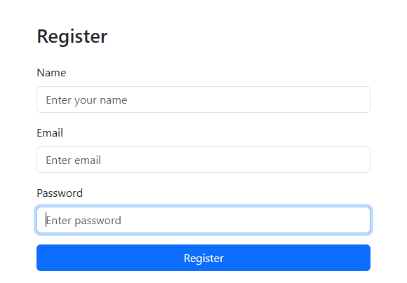
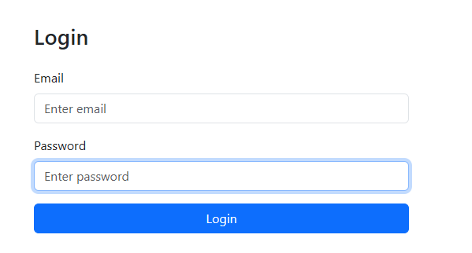
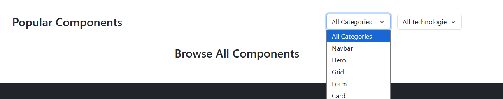

# UI Forge 

UI Forge is a full‑stack platform for discovering, testing, and managing reusable UI snippets.  
It combines a **React + Vite frontend** with a **Node.js + Express + MongoDB backend**, providing authentication, snippet search, and support features.
You can view the live demo of the site here https://github.com/

## 🌍 UI Forge and the UN Sustainable Development Goals (SDGs)
UI Forge is more than a snippet library — it’s a platform that empowers developers, educators, and communities to build scalable solutions. 

### SDG 4: Quality Education

- Provides open access to reusable UI snippets and clear documentation.

- Helps students, educators, and self‑learners accelerate their projects without reinventing the wheel.
---

## ✨ Features
- 🔐 **Authentication**: Register, login, and manage sessions with JWT.


- 📚 **Snippet Library**: Search and filter UI snippets by category, framework, and tags.

- 🛠️ **Support System**: Submit feedback or issues directly from the frontend.
- ⚡ **Modern Stack**: React, Vite, TailwindCSS, Node.js, Express, MongoDB.
- 🧩 **Centralized API Service**: Axios service layer for clean frontend requests.
- 🩺 **Health Check**: `/api/health` endpoint to verify backend connectivity.

---

## 📂 Project Structure
ui-forge/ ├── client/ # Frontend (React + Vite) │ ├── src/ │ │ ├── components/ # Reusable UI components │ │ ├── pages/ # Page-level views (Home, Login, Register) │ │ ├── services/ # API service layer (api.ts) │ │ └── context/ # AuthContext for global state │ └── .env.example # Example environment variables for frontend ├── server/ # Backend (Node.js + Express) │ ├── src/ │ │ ├── models/ # Mongoose models (User, Snippet) │ │ ├── routes/ # Express routes (auth, snippets, support) │ │ └── server.js # Entry point │ └── .env.example # Example environment variables for backend └── README.md


---

## ⚙️ Setup

### 1. Clone the repository
```bash
git clone https://github.com/your-username/ui-forge.git
cd ui-forge
2. Backend setup
bash
cd server
npm install
Create .env from .env.example:

env
PORT=5000
MONGO_URI=mongodb://localhost:27017/uiforge
JWT_SECRET=supersecretkey123
CLIENT_URL=http://localhost:5173
Run backend:

bash
npm run dev
3. Frontend setup
bash
cd client
npm install
Create .env from .env.example:

env
VITE_API_URL=http://localhost:5000/api
VITE_APP_NAME=UI Forge
Run frontend:

bash
npm run dev
``` 

## 🧪 Testing
Health Check
Visit http://localhost:5000/api/health 
Expected response:

json
{ "status": "ok", "message": "UI Forge backend is running 🚀" }
Auth
Register: POST /api/auth/register

Login: POST /api/auth/login


## 🤝 Contributing
Fork the repo

Create a feature branch (git checkout -b feature/my-feature)

Commit changes (git commit -m "Add my feature")

Push branch (git push origin feature/my-feature)

Open a Pull Request

## 📜 License
MIT License © 2025 UI Forge Contributor